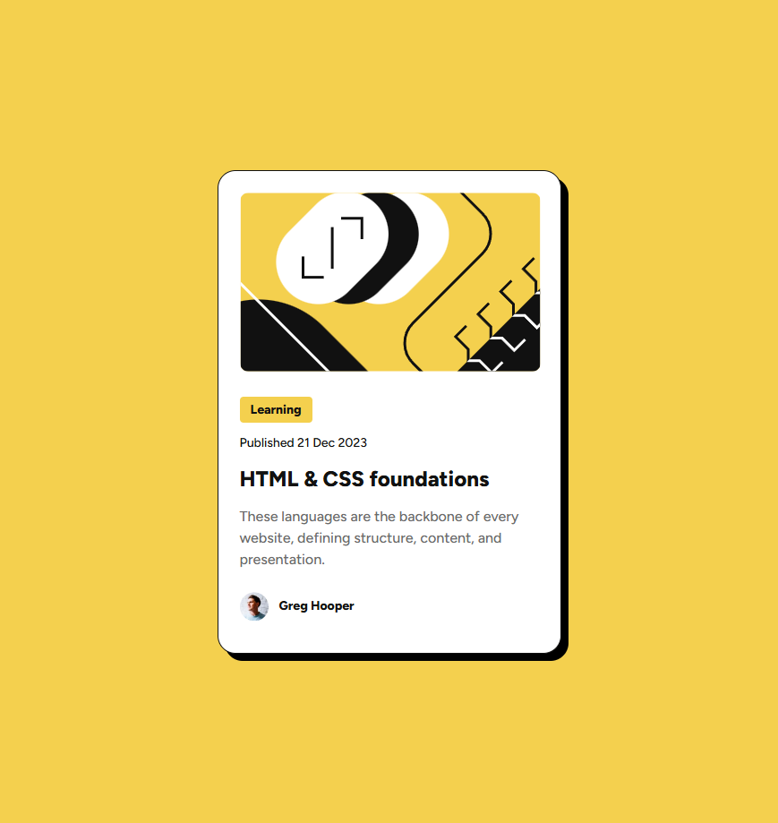

# Frontend Mentor - Blog preview card solution

This is a solution to the [Blog preview card challenge on Frontend Mentor](https://www.frontendmentor.io/challenges/blog-preview-card-ckPaj01IcS). Frontend Mentor challenges help you improve your coding skills by building realistic projects. 

## Table of contents

- [Overview](#overview)
  - [The challenge](#the-challenge)
  - [Screenshot](#screenshot)
  - [Links](#links)
- [My process](#my-process)
  - [Built with](#built-with)
  - [What I learned](#what-i-learned)
  - [Continued development](#continued-development)
  - [Useful resources](#useful-resources)

## Overview

### The challenge

Users should be able to:

- See hover and focus states for all interactive elements on the page

### Screenshot

### Links

- Solution URL: https://github.com/oridr/blog-preview-card
- Live Site URL: https://oridr.github.io/blog-preview-card

## My process

### Built with

- Semantic HTML5 markup
- CSS custom properties
- Flexbox
- Clamp

### What I learned

* CSS Clamp
* CSS Nesting
* wai-aria - ignore decorative images using `alt="" role="presentation"` 

### Continued development

* Complex Layouts

### Useful resources

- [Decorative Images](https://www.w3.org/WAI/tutorials/images/decorative/) - Ignore decorative images
- [Sampling Figma without Dev Mode](https://www.youtube.com/watch?v=2SWCN9vCtOw) - Nice legal workaround, if you don't want to pay Figma
